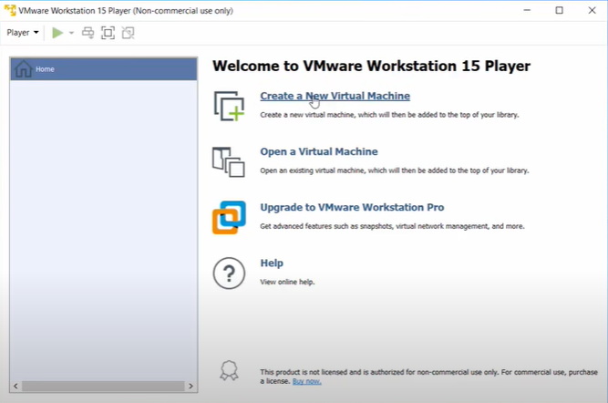
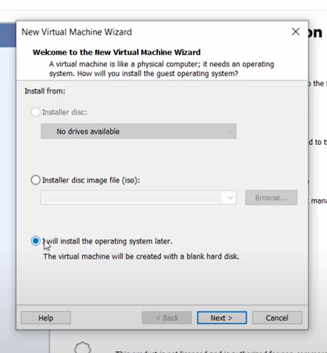
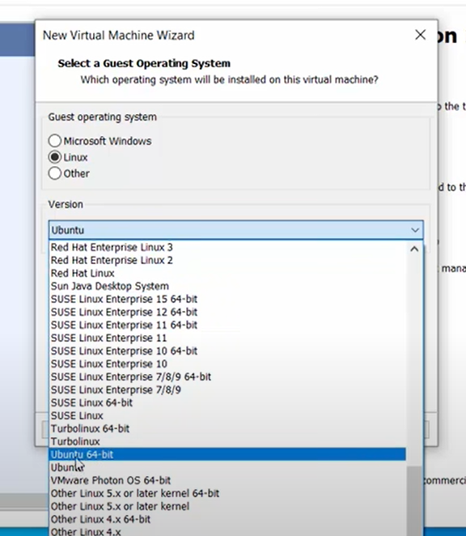
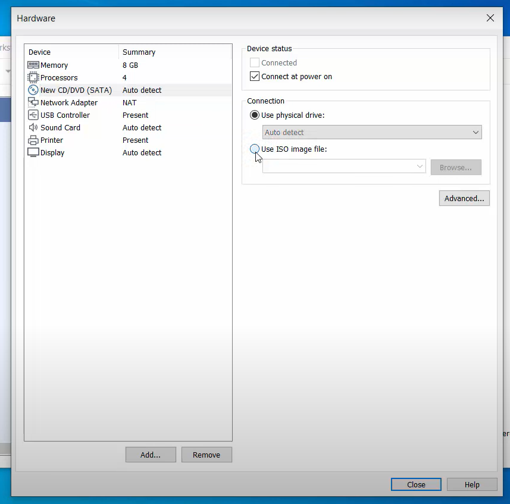
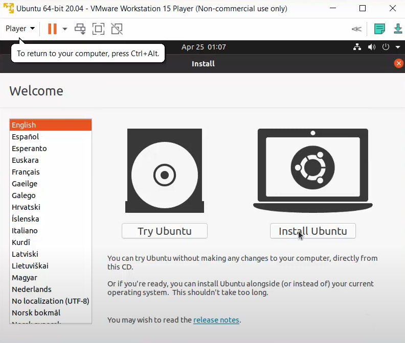
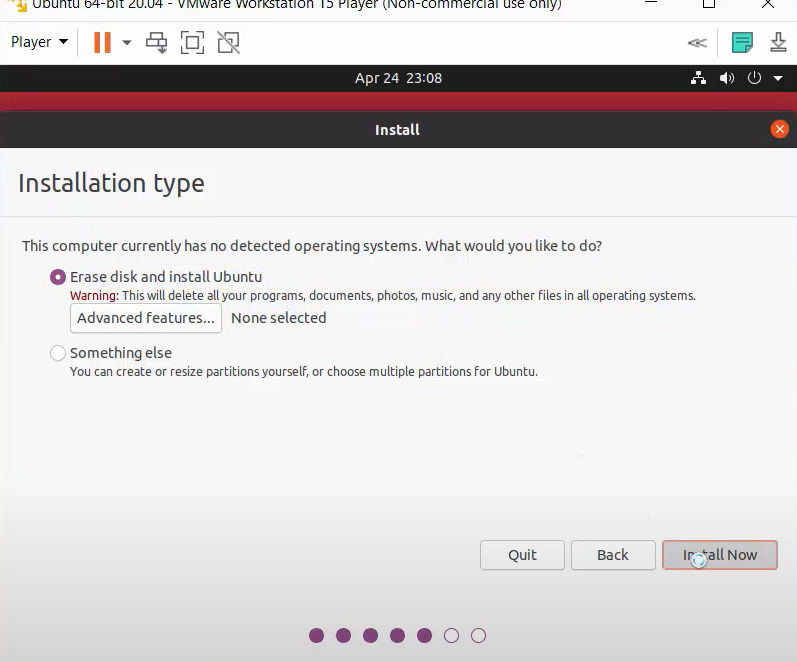

# ROS-Noetic-installation
Installation of ROS Noetic on VM ware/Ubuntu

This README.md covers 
- Installation and setting up Ubuntu on the VMware Workstation 
- Installation of ROS Noetic on the VMware
- Installing and Configuring Your ROS Workspace (catkin_ws)

## Installation and Set-up of VMware Workstation
Click this [link](https://customerconnect.vmware.com/en/downloads/details?downloadGroup=WKST-PLAYER-1612&productId=1039&rPId=66621)   
The above link will take you to a website from where you can install the VMware Workstation player. Choose and download the apropraite version of the VMware based on your system configuration.   

For further guidance on installation click [here.](https://xpertstec.com/how-to-install-vmware-workstation-player-16/)

### Set up Ubuntu on the VMware
You can either watch [this](https://www.youtube.com/watch?v=9rUhGWijf9U&ab_channel=ProgrammingKnowledge) video or scroll ahead to read through this guide    

- First download the Ubuntu ISO file from [here.](https://ubuntu.com/download/desktop/thank-you?version=20.04.3&architecture=amd64)
- Open your VMware and click on Create a New Virtual Machine

    

- Choose I will install the operating system later option in the next window and click next

   

- Choose Linux and change the Version according to your system and click next

   

- Type in the name of your virtual machine and choose the desired location and click next   
- Give maximum disk space as 100GB and click next   
- Click on Customize hardware and the below window opens up. Under Memory move the slider to 8GB and Under processors change the Number of processor cores to 4    
 
- Click on New CD/DVD (SATA) on the left and choose Use ISO image and browse for the installed ISO file for ubuntu. Once that is done click on close and then finish.  

   

- Now you should be able to see the newly created virtual machine in the VMware Workstation player. Click on Play virtual machine. 
- Next you see the below on your screen. Choose the language and click Install Ubuntu



- Choose your keyboard layout
- Select Normal installation and check Install third-party software and click continue
- Select the Installation type as below and click on Install now. This does not harm or remove the data on your host machine
-


- Follow the installation and your virtual machine is all set up and ready to use   

## Installation of ROS Noetic on the VMware or native Ubuntu
Now we will see how to install ROS Noetic in ubuntu
You can find the installation guide on the ros wiki [here.](http://wiki.ros.org/noetic/Installation/Ubuntu)
Alternatively you can also follow the steps here:
(Note: All the commands must be run in your home directory and not in **any other directory**)
### Setting up your ubuntu Repositaries
First we need to configure your Ubuntu repositories to allow "restricted," "universe," and "multiverse." To do so we run the following code:
```bash
sudo add-apt-repository universe
sudo add-apt-repository multiverse
sudo add-apt-repository restricted
```
This should set up your Ubuntu repositaries to double check you can run the ```grep ^deb /etc/apt/sources.list``` as well.
### Starting the ros installation
#### Setup your sources.list
Setup your computer to accept software from packages.ros.org.
```bash
sudo sh -c 'echo "deb http://packages.ros.org/ros/ubuntu $(lsb_release -sc) main" > /etc/apt/sources.list.d/ros-latest.list'
```
#### Setup your keys
```bash
sudo apt install curl # if you haven't already installed curl
curl -s https://raw.githubusercontent.com/ros/rosdistro/master/ros.asc | sudo apt-key add -
```
#### Installation
First, make sure your Debian package index is up-to-date:
```bash
sudo apt update
```
Now finally run the command to install the whole package
```bash
sudo apt install ros-noetic-desktop-full
```
#### Environment setup
We will convienently set up our bashrc file to source the setup file for ros as soon as you open a terminal (You can add roscore to your bashrc file as well if you wish to run it everytime you start a terminal)
```bash
echo "source /opt/ros/noetic/setup.bash" >> ~/.bashrc
source ~/.bashrc
```
Now if you open your bashrc file you should see the `source /opt/ros/noetic/setup.bash` automoatically added.

Finally to test if your installation has properly worked we run this command:
```
roscore
```
## Installing and Configuring Your ROS Workspace (catkin_ws)
Now we will be creating your catkin workspace. Catkin workspace is a very important tool of the newer versions of ros. We will be setting up our own catkin_ws and also compiling and running a basic listener and talker node to test correct installation of ros as well as working of the catkin workspace
### Setting up your catkin workspace
To set up just run the following commands:
```bash
mkdir -p ~/catkin_ws/src
cd ~/catkin_ws/
catkin_make
```
The catkin_make command is a convenience tool for working with catkin workspaces. Running it the first time in your workspace, it will create a CMakeLists.txt link in your 'src' folder. We now have to make sure we source the catkin_ws/deval/setup.bash to do this we run the following command in the home directory:
```bash
echo "source /home/user/catkin_ws/devel/setup.bash" >> ~/.bashrc
source ~/.bashrc
```
**NOTE: REPLACE USER WITH YOUR OWN USER ID**
### Cloning this repo and running a example
Now we will clone this repo and 
